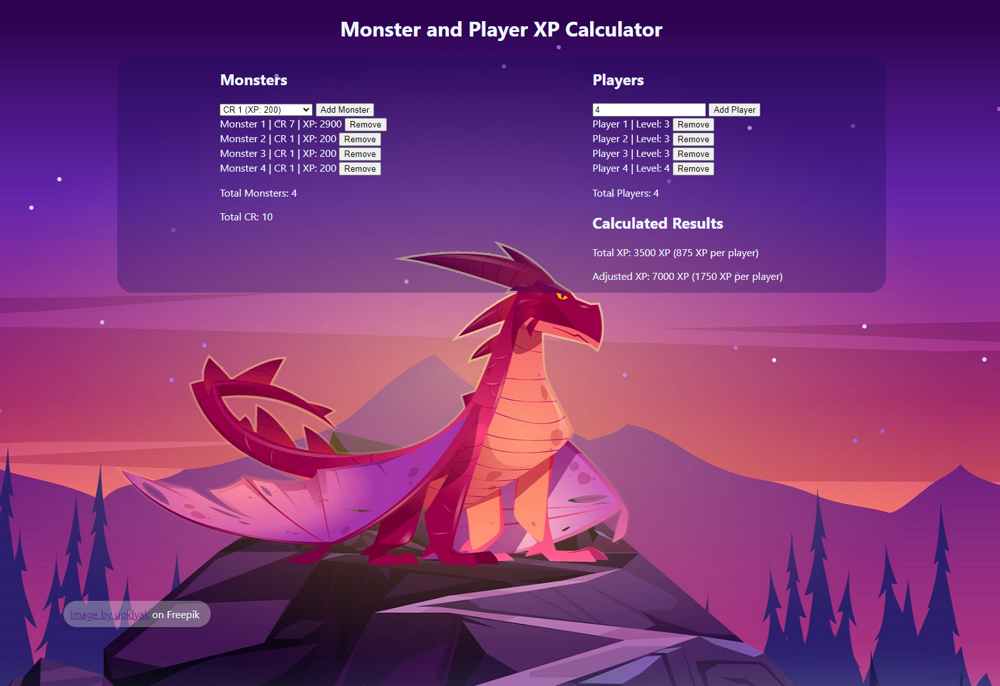

# D&D 5e XP Calculator

A web-based tool to calculate the total XP and adjusted XP for a Dungeons & Dragons encounter.

## Project Overview

The Monster XP Calculator is designed to assist Dungeon Masters in calculating the XP values for a D&D encounter based on the difficulty of monsters and player levels. It allows users to add and remove monsters with different challenge ratings and add or remove players with different levels. The calculator automatically calculates the total XP and adjusted XP based on the selected monsters. The project is implemented using HTML, CSS, and JavaScript.

## Demo

{:height="300px" width="500px"}

## Technologies Used

- HTML
- CSS
- JavaScript

## Features

- Add and remove monsters with different challenge ratings.
- Add and remove players with different levels.
- Calculate the total XP based on the selected monsters.
- Calculate the adjusted XP based on the number of monsters and players and the challenge rating.

## Project Structure

```
|-- index.html
|-- main.css
|-- xpCalculator.js
|-- assets/
| |-- dragonbackground.jpg
| |-- dndCalculatorScreenshot.jpg
|-- README.md
```

## Development Process

During the development process, I focused on creating accurate XP calculations to be usable for the game.
I encountered challenges in integrating the 3 fraction values in a list full of integers. I also found it difficult to successfully recalculate when removing an element.

To overcome these challenges, I utilized parseFloat() to convert strings back into numbers, DOM manipulation, and the .splice() method to separate monsters and players from their arrays. I also implemented error handling for invalid inputs.

Overall, I aimed to create an accurate and efficient tool for Dungeon Masters to plan encounters.

## Future Enhancements

- Implement a feature to save encounters for future reference.
- Include feature that tells user when the encounter is difficult or easy.
- Fix numbers in lists when one is removed from the middle.

## Getting Started

To set up and run the Monster XP Calculator locally, follow these steps:

1. Clone the repository: git clone https://github.com/Ryan-Biondo/dnd-encounter-tool
2. Open the `index.html` file in your web browser.

## Usage

- Use the interface to add monsters by selecting their challenge rating from the dropdown menu and clicking the "Add Monster" button.
- Use the interface to add players by entering their level in the input field and clicking the "Add Player" button.
- The total XP and adjusted XP will be calculated and displayed automatically based on the selected monsters and players.
- To remove a monster or player, click the "Remove" button next to their entry.

## Contributing

Contributions to this project are currently not accepted. However, if you have any suggestions or feedback, please feel free to reach out to me.

## License

All rights reserved. This project's code and content are protected under copyright law. You may not reproduce, modify, or distribute the code or content without explicit permission from the project author.

<!-- ## Acknowledgments -->
